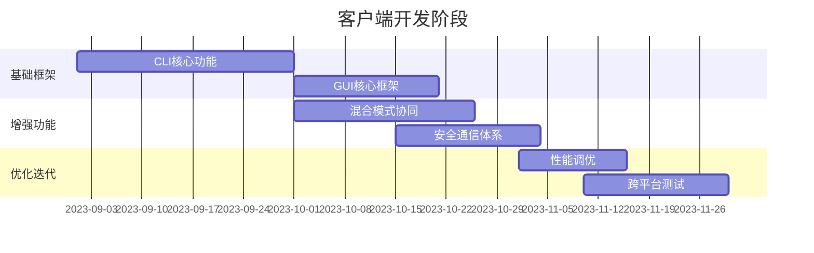

# 客户端模块补充需求说明书

## 一、客户端定位
1. **双重模式架构**：
   - 命令行模式（CLI）：面向运维人员的批处理操作
   - 图形界面模式（GUI）：面向分析人员的交互式监控

2. **核心价值点**：
   ```mermaid
   graph LR
   A[客户端] --> B[实时指令下发]
   A --> C[拓扑可视化]
   A --> D[策略管理]
   A --> E[取证数据导出]
   ```

## 二、详细功能需求

### 1. CLI模式核心功能
| 功能模块       | 技术实现方案                  | Go特性利用点               |
|----------------|-----------------------------|--------------------------|
| 批量节点控制   | cobra + gRPC stream         | 流式响应处理              |
| 流量重放       | pcap文件流式上传            | io.Pipe异步传输          |
| 策略热更新      | inotify+etcd监听           | fsnotify文件监控         |
| 性能诊断       | 集成pprof远程调试           | net/http/pprof 嵌入     |
| 认证体系       | mTLS双向认证                | crypto/tls原生支持       |

### 2. GUI模式核心功能
```go
// 示例GUI数据订阅架构
type Dashboard struct {
    websocket.Conn
    filters map[string]Filter
}

func (d *Dashboard) StreamData() {
    for {
        select {
        case data := <-kafka.Consumer:
            if d.matchFilter(data) {
                d.Send(proto.Marshal(data)) // 使用protobuf压缩
            }
        case cmd := <-d.CommandChan:
            d.handleCommand(cmd) // 处理界面操作指令
        }
    }
}
```

#### GUI特殊需求：
- **实时拓扑渲染**：使用WebAssembly运行d3.js布局引擎
- **流量瀑布图**：基于Canvas实现的时序渲染
- **协议着色系统**：动态颜色编码规则引擎
- **智能警报**：滑动窗口异常检测算法
- **取证回放**：集成Wireshark解码引擎

## 三、混合模式创新设计

1. **模式协同机制**：
   ```
   +----------------+     +---------------+
   |   GUI可视化    |<-->| 共享状态存储  |
   +----------------+     +---------------+
           ^  ^                ^  |
           |  +----------------+  |
           v                       v
   +----------------+     +----------------+
   | CLI批处理引擎  |<-->| 命令历史仓库   |
   +----------------+     +----------------+
   ```

2. **关键技术实现**：
   - **终端图形化**：使用termui库实现CLI仪表盘
   ```go
   // CLI图形化示例
   func renderCLIDashboard(stats *Stats) {
       ui.Init()
       defer ui.Close()
       
       spark := widgets.NewSparkline()
       spark.Data = stats.Netflow
       spark.Title = "实时流量"
       
       grid := ui.NewGrid()
       grid.SetRect(0, 0, 50, 20)
       grid.Set(ui.NewRow(1.0, spark))
       ui.Render(grid)
   }
   ```
   - **GUI命令行融合**：在图形界面嵌入REPL控制台
   - **跨模式状态同步**：基于CRDT的分布式状态机

## 四、通信架构增强

1. **安全通道设计**：
   ```
                            +-----------------+
                            |   OPA策略引擎   |
                            +-----------------+
                                     ^
                                     |
   +------------+       mTLS+QUIC    v       +------------+
   |   CLI客户端| <=======================> | Controller |
   +------------+    双向流式通信    +------------+
                                     ^
                                     | WebTransport
   +------------+                    |       +------------+
   |  GUI客户端 | <-------------------+----> | 数据分析层 |
   +------------+   WASM数据推送     +------------+
   ```

2. **协议优化措施**：
   - 头部压缩：使用QPACK算法减少重复元数据
   - 流优先级：设置HTTP/2流权重参数
   ```go
   // 流优先级设置示例
   tr := &http2.Transport{
       DialTLS: dialTLS,
       ConnPool: NewClientConnPool(
           http2.ConnPoolConfig{
               MaxConcurrentStreams: 100,
               StreamPriority: http2.StreamPriorityParam{
                   Weight:    200,
                   StreamDep: 0,
                   Exclusive: false,
               },
           }),
   }
   ```

## 五、客户端特殊需求

1. **跨平台要求**：
   - 支持Linux/MacOS/Windows的ARM/x86架构
   - 单二进制交付（包含Web资源）
   ```bash
   # 资源嵌入示例
   go build -tags embed -o sniffer-cli
   ```

2. **性能指标**：
   | 场景          | CLI响应延迟 | GUI渲染帧率 |
   |--------------|------------|------------|
   | 千节点状态查询| <200ms     | N/A        |
   | 实时流量展示  | N/A        | ≥30fps     |
   | 历史数据检索  | <1s        | <2s        |

3. **可观测性增强**：
   - 客户端性能埋点（CPU/内存/网络）
   - 用户操作行为审计日志
   - 界面操作热力图分析

## 六、推荐技术栈

| 模块          | CLI方案                | GUI方案                  |
|---------------|-----------------------|-------------------------|
| 框架基础      | cobra + promptui      | fyne + webview          |
| 数据可视化    | termui + asciigraph   | echarts + gio           |
| 网络通信      | grpc-gateway          | websocket + quic-go     |
| 安装包管理    | go-installer          | electron-builder        |
| 跨平台构建    | gox + goreleaser      | wails + lorca           |

该设计将充分发挥Go语言的以下优势：
1. **单一代码库**：通过构建标签管理多模式代码
   ```go
   // +build cli
   func main() { /* CLI入口 */ }
   
   // +build gui
   func main() { /* GUI入口 */ }
   ```
2. **原生并发安全**：GUI事件循环与网络IO的goroutine协同
3. **零依赖部署**：静态编译包含所有GUI资源
4. **高效协议处理**：基于内存池的快速编解码

建议采用分阶段实施策略：
