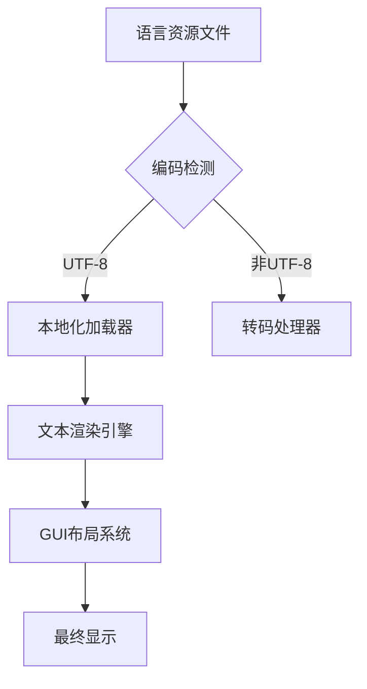

### **一、多语言架构设计**


---

### **二、核心实现步骤**

#### **1. 资源文件管理**
- **目录结构**：
  ```
  locales/
  ├── active.en.toml
  ├── ar.toml
  ├── de.toml
  ├── en.toml
  ├── fr.toml
  ├── ja.toml
  ├── ko.toml
  ├── zh-Hans.toml
  └── zh-Hant.toml
  ```

- **TOML格式示例**：
  ```toml
  # zh-Hans.toml
  [dashboard]
  title = "流量分析看板"
  refresh = "刷新频率：{{.interval}}秒"
  
  [errors]
  timeout = "连接超时（错误代码：%04X）"
  ```

#### **2. 动态加载机制**
```go
type Localizer struct {
    bundles map[language.Tag]*i18n.Bundle
    current language.Tag
}

func (l *Localizer) Load(lang string) error {
    tag := language.MustParse(lang)
    bundle := i18n.NewBundle(tag)
    bundle.RegisterUnmarshalFunc("toml", toml.Unmarshal)
    
    // 加载基础语言文件
    bundle.MustLoadMessageFile(fmt.Sprintf("locales/%s.toml", lang))
    
    // 加载激活的覆盖配置
    if _, err := os.Stat(fmt.Sprintf("locales/active.%s.toml", lang)); !os.IsNotExist(err) {
        bundle.MustLoadMessageFile(fmt.Sprintf("locales/active.%s.toml", lang))
    }
    
    l.bundles[tag] = bundle
    return nil
}
```

---

### **三、特殊语言处理**

#### **1. 阿拉伯语RTL支持**
```go
func applyRTLLayout(container *fyne.Container) {
    if currentLang == "ar" {
        // 反转子元素顺序
        children := container.Objects
        for i, j := 0, len(children)-1; i < j; i, j = i+1, j-1 {
            children[i], children[j] = children[j], children[i]
        }
        
        // 调整对齐方式
        container.Layout = layout.NewPaddedLayout(
            layout.DirectionRightToLeft,
            layout.AlignmentLeading,
        )
    }
}
```

#### **2. 中日韩文字优化**
- **字体回退机制**：
  ```go
  func getSystemFonts() []string {
      switch runtime.GOOS {
      case "windows":
          return []string{"Microsoft YaHei", "Meiryo", "Malgun Gothic"}
      case "darwin":
          return []string{"PingFang SC", "Hiragino Sans", "Apple SD Gothic Neo"}
      default:
          return []string{"Noto Sans CJK SC", "Noto Sans JP", "Noto Sans KR"}
      }
  }
  ```

- **竖排日文支持**：
  ```css
  /* 嵌入CSS处理特殊排版 */
  .vertical-text {
      writing-mode: vertical-rl;
      text-orientation: upright;
  }
  ```

---

### **四、动态切换实现**

#### **1. 语言切换器组件**
```go
type LanguageSwitcher struct {
    selector *widget.Select
    locales  map[string]language.Tag
}

func NewLanguageSwitcher() *LanguageSwitcher {
    ls := &LanguageSwitcher{
        locales: map[string]language.Tag{
            "العربية":     language.MustParse("ar"),
            "English":    language.MustParse("en"),
            "简体中文":     language.MustParse("zh-Hans"),
            // ...其他语言
        },
    }
    ls.selector = widget.NewSelect(ls.getLanguageNames(), ls.onSelected)
    return ls
}

func (ls *LanguageSwitcher) getLanguageNames() []string {
    names := make([]string, 0, len(ls.locales))
    for name := range ls.locales {
        names = append(names, name)
    }
    sort.Strings(names) // 按字母顺序排序
    return names
}
```

#### **2. 实时更新机制**
```go
// 注册观察者模式
var langObservers []func(language.Tag)

func NotifyLanguageChange(newLang language.Tag) {
    for _, observer := range langObservers {
        observer(newLang)
    }
}

// 在UI组件中订阅变更
button := widget.NewButton("", nil)
langObservers = append(langObservers, func(tag language.Tag) {
    button.SetText(localize("ui.refresh_button"))
})
```

---

### **五、本地化质量保障**

#### **1. 自动化校验工具**
```bash
# 检查未翻译项
grep -hroE '{{t\s+\"[^\"]+\"' ./gui | sort | uniq > all_keys.txt
cat locales/*.toml | grep -o '^\[.*\]' | cut -d. -f2- | sort | uniq > translated_keys.txt
comm -23 all_keys.txt translated_keys.txt
```

#### **2. 特殊字符测试矩阵**
| 语言       | 测试用例                  | 预期效果                 |
|------------|---------------------------|--------------------------|
| 阿拉伯语   | "قيمة %d في النص"        | 数字保持左到右           |
| 中文简体   | "连接数：1,000"           | 正确显示逗号分隔         |
| 日语       | "パケット速度：100Mbps"   | 全角字符对齐             |
| 韩语       | "경고: 오류 코드 0xA1"   | 混合字符无断行           |
| 德语       | "Größe: 1.5 MB"          | 变音符号正确渲染         |

---

### **六、推荐技术栈**
| 功能           | 推荐库                  | 关键特性                          |
|----------------|-------------------------|-----------------------------------|
| 国际化框架     | go-i18n/v2             | 支持复数形式/嵌套翻译             |
| 字体渲染       | gofpdf/fontmaker       | 动态嵌入字体子集                  |
| 布局系统       | fyne.io/x/text         | 原生RTL支持                       |
| 本地化校验     | x/text/language        | BCP47标准验证                     |
| 动态热重载     | fsnotify               | 文件变更监听                      |

---

### **七、注意事项**
1. **阿拉伯语数字**：
   ```go
   // 使用ICU库转换数字表示形式
   import "golang.org/x/text/feature/plural"
   import "golang.org/x/text/message/catalog"
   
   catalog.Override(language.Arabic, plural.One, "مثال: %d عنصر") 
   ```

2. **日期格式本地化**：
   ```go
   func formatLocalizedDate(t time.Time, lang string) string {
       loc := message.NewPrinter(language.MustParse(lang))
       return loc.Sprintf("%s", t.Format(localizedLayout))
   }
   ```

3. **复数处理规则**：
   ```toml
   # en.toml
   [metrics.packets]
   one = "%d packet"
   other = "%d packets"
   
   # ar.toml
   [metrics.packets]
   zero = "لا توجد حزم"
   one = "حزمة واحدة"
   two = "حزمتان"
   few = "%d حزم"
   many = "%d حزمة"
   other = "%d حزمة"
   ```

该方案可确保：
- 单二进制包含所有语言资源
- 动态切换无需重启应用
- 自动处理RTL等特殊布局
- 符合各语言本地化规范
- 支持后续扩展新语言