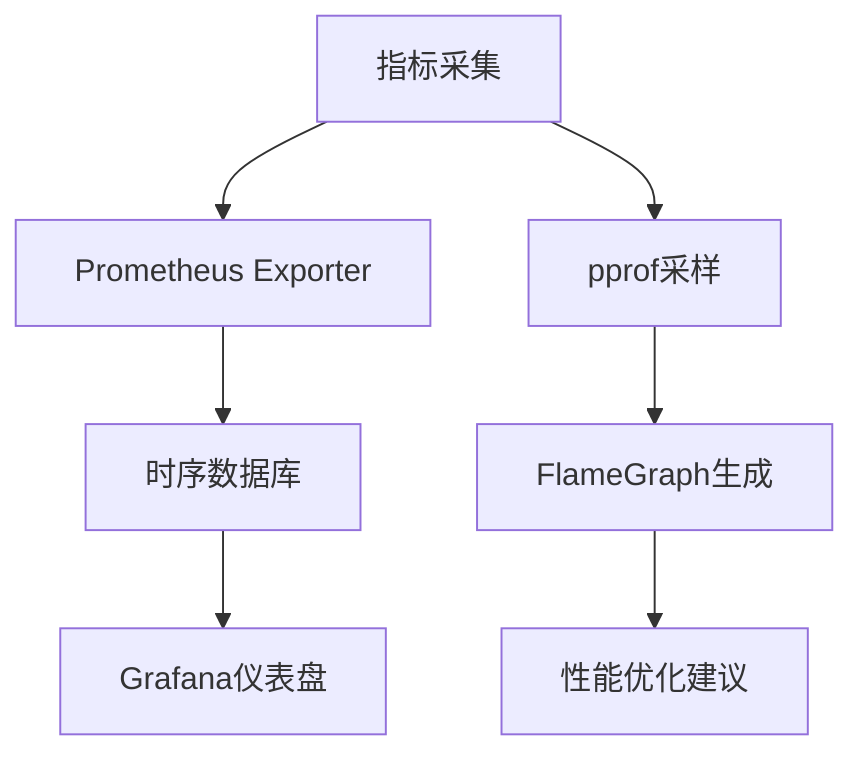

### **一、网络流量处理层核心技术**
1. **零拷贝抓包引擎**
   - **gopacket + XDP(eXpress Data Path)**：绕过内核协议栈直接处理网卡数据
   - **AF_PACKET + Ring Buffer**：使用内存映射实现高效数据传递
   ```go
   // XDP示例
   xsk, _ := af_xdp.NewSocket()
   defer xsk.Close()
   for {
       frames := xsk.Receive()  // 直接获取原始帧
       for _, frame := range frames {
           go processFrame(frame)  // 每个帧独立处理
       }
   }
   ```

2. **协议解析加速**
   - **TCP重组状态机**：基于红黑树的高效流管理
   - **JIT协议解析**：将协议描述编译为机器码
   - **TLS指纹识别**：JA3/JA3S算法实现

---

### **二、分布式协调核心技术**
1. **一致性协议**
   - **Raft共识算法**：基于`hashicorp/raft`库实现
   - **分片策略**：CRUSH算法优化数据分布
   ```go
   // Raft配置示例
   config := raft.DefaultConfig()
   store := raftboltdb.NewBoltStore(filepath.Join(dataDir, "raft.db"))
   snapshots := raft.NewDiscardSnapshotStore()
   raft.NewRaft(config, (*FSM)(s), store, store, snapshots, trans)
   ```

2. **流量调度引擎**
   - **动态负载均衡**：基于EWMA的权重计算
   - **优先级队列**：实现多级反馈调度
   ```go
   type PriorityWorker struct {
       highPri chan Task
       lowPri  chan Task
   }
   func (w *PriorityWorker) Schedule() {
       select {
       case task := <-w.highPri: // 优先处理高优先级
           process(task)
       default:
           select {
           case task := <-w.highPri:
               process(task)
           case task := <-w.lowPri: // 次级处理
               process(task)
           }
       }
   }
   ```

---

### **三、高性能数据处理管道**
| 技术组件         | 实现方案                          | 性能优化手段                   |
|------------------|-----------------------------------|------------------------------|
| **数据序列化**   | FlatBuffers + Zstandard          | 零GC序列化/并行压缩           |
| **流式处理**     | Goroutine Pipeline               | Work-Stealing调度策略         |
| **内存管理**     | Sync.Pool + Slab分配器           | 对象复用与内存预分配          |
| **持久化存储**   | RocksDB + WAL日志                | LSM-Tree结构优化              |
| **实时计算**     | 滑动窗口算法                      | 基于环形缓冲区的增量计算      |

---

### **四、安全通信体系**
1. **传输层加密**
   - **QUIC协议栈**：集成`quic-go`库
   - **动态密钥轮换**：TLS 1.3会话票据机制
   ```go
   quicConfig := &quic.Config{
       KeepAlive: true,
       TokenStore: quic.NewLRUTokenStore(1000),
       Versions: []quic.VersionNumber{quic.Version1},
   }
   ```

2. **访问控制**
   - **OPA策略引擎**：实现RBAC权限模型
   - **JWT令牌验证**：ECDSA签名校验
   ```go
   // OPA策略执行
   input := map[string]interface{}{"user": user, "action": action}
   result, _ := rego.New(rego.Query("data.authz.allow"), rego.Input(input)).Eval(ctx)
   ```

---

### **五、可观测性技术栈**


1. **分布式追踪**
   - OpenTelemetry Span传播
   - 基于Baggage的跨服务追踪
   ```go
   tracer := otel.Tracer("flowmesh")
   ctx, span := tracer.Start(ctx, "packet_processing")
   defer span.End()
   ```

2. **异常检测**
   - 孤立森林算法实现异常流量识别
   - 基于Holt-Winters的时间序列预测

---

### **六、部署运维核心技术**
1. **动态二进制管理**
   - **Go Plugin系统**：实现协议解析器的热加载
   ```go
   plugin, _ := plugin.Open("./protocols/http2.so")
   sym, _ := plugin.Lookup("Parser")
   parser := sym.(ProtocolParser)
   ```

2. **集群编排**
   - **Kubernetes Operator**：自定义CRD资源定义
   - **水平自动扩展**：基于自定义指标的HPA

3. **混沌工程**
   - **Network Partition模拟**：使用gNETman库
   - **故障注入框架**：随机杀死指定比例的goroutine

---

每个技术点都深度结合了Go语言的以下核心优势：
1. **并发模型**：Goroutine+Channel的CSP实现
2. **内存管理**：逃逸分析与智能堆栈分配
3. **编译特性**：跨平台静态链接与deadcode消除
4. **标准库**：丰富的网络协议原生支持
5. **工具链**：竞态检测与性能剖析工具

建议通过`go build -tags=distributed,secure`方式管理不同构建模式，实现核心技术的灵活组合。