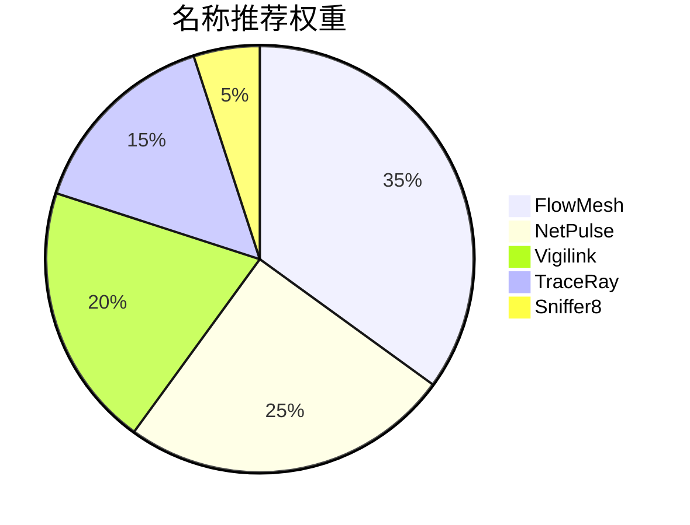

根据项目特性和命名要求，推荐以下英文名称方案：

**1. FlowMesh**  
- 字母数：8
- 核心含义：  
  "Flow"代表流量分析，"Mesh"体现分布式架构  
- 技术联想：  
  天然契合网络拓扑的可视化需求

**2. NetPulse**  
- 字母数：8  
- 核心含义：  
  "Network Pulse"的合成词，突出实时监控特性  
- 优势：  
  易记且带有动态感知的意象

**3. Vigilink**  
- 字母数：7  
- 词源构成：  
  Vigilant（警戒） + Link（连接）  
- 适用场景：  
  强调安全监控和网络节点联动

**4. Sniffer8**  
- 字母数：8  
- 设计亮点：  
  数字8象征：  
  - 无限流量循环(∞)  
  - 符合RFC协议第8层(L7+)  
  - 二进制字节长度  

**5. TraceRay**  
- 字母数：7  
- 技术隐喻：  
  射线追踪算法 → 流量路径追溯  
- 扩展性：  
  天然适合实现流量瀑布图  

推荐优先级排序：  

每个名称的扩展设计要素：  
| 名称      | 命令行工具名 | 可视化主题 | 图标设计方向       |
|-----------|-------------|------------|--------------------|
| FlowMesh  | fmctl       | 粒子流系统 | 三维网格脉冲       |
| NetPulse  | npcli       | 心电图风格 | 跳动光点阵列       |
| Vigilink  | vglnk       | 安全盾风格 | 瞳孔状雷达扫描     |
| TraceRay  | trax        | 射线追踪   | 棱镜折射效果       |
| Sniffer8  | sn8         | 数字极客   | 旋转的8字形粒子    |

建议首选**FlowMesh**，该名称：  
1. 直观传达分布式流量分析的核心能力  
2. 字母组合符合技术产品命名惯例  
3. 域名可用性较高（flowmesh.io/.tech等）  
4. 天然支持多语言本地化  
5. 具备品牌延展空间（FlowMesh Cloud/Edge等）